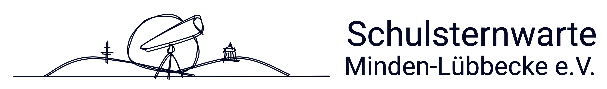
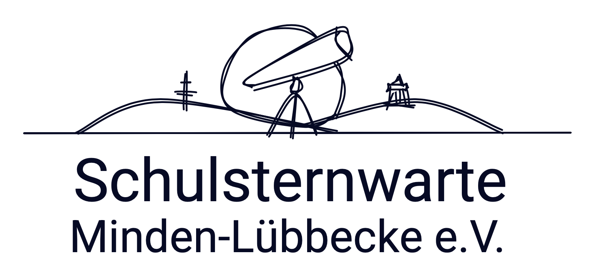
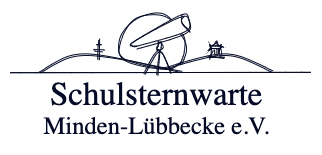
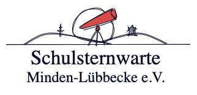
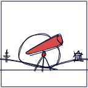

# Design für Schulsternwarte Minden-Lübbecke e.V.

## Farbpalette

Die folgende Farbpalete orientiert sich an den Farben eines Abend- und Nachthimmels. Auf diesen Farben basiert dann auch die Variation in der Darstellung des Logos.

<table style="width: fit-content">
    <thead>
        <tr>
            <th>Beispiel</th>
            <th>Varaiblename der Farbe und Hex</th>
        </tr>
    </thead>
    <tr style="">
        <td style="vertical-align: center; text-align: center; padding: 10px">
            
        </td>
        <td>
            --space-1: #050A26;
        </td>
    </tr>
    <tr>
        <td style="vertical-align: center; text-align: center; padding: 10px">
            
        </td>
        <td>
            --space-2: #081040;
        </td>
    </tr>
    <tr>
        <td style="vertical-align: center; text-align: center; padding: 10px">
            
        </td>
        <td>
            --space-3: #101F73;
        </td>
    </tr>
    <tr>
        <td style="vertical-align: center; text-align: center; padding: 10px">
            
        </td>
        <td>
            --space-4: #1228A6;
        </td>
    </tr>
    <tr>
        <td style="vertical-align: center; text-align: center; padding: 10px">
            
        </td>
        <td>
            --space-5: #D94A4A;
        </td>
    </tr>
    <tr>
        <td style="vertical-align: center; text-align: center; padding: 10px">
            
        </td>
        <td>
            --space-6: white;
        </td>
    </tr>
    <tr>
    </tr>
</table>

## Logo

Das Basislogo erlaubt den Text unter oder rechts des Logos zu platzieren. Die Schrift soll der Google Font [Heebo](https://fonts.google.com/specimen/Heebo?query=heebo) sein. Leider läuft derzeit noch etwas beim Export schief, weshalb hier in den Demos der falsche Schriftzug erscheint. Daher hier die beiden Varianten als Screenshots...  🙈





<table>
    <tr>
        <td>
            
        </td>
        <td>
            
        </td>
    </tr>
    <tr>
        <td>
            
        </td>
        <td>
            
        </td>
    </tr>
    <tr>
        <td>
            
        </td>
        <td>
            
        </td>
    </tr>
    <tr>
        <td>
            
        </td>
        <td>
            
        </td>
    </tr>
    <tr>
        <td>
            
        </td>
        <td>
            
        </td>
    </tr>
    <tr>
        <td>
            
        </td>
        <td>
            
        </td>
    </tr>
</table>

## Favicon

Aus dem Logo ergäbe sich bspw. diese Möglichkeit für ein Favicon


Das generierte Favicon Set von [Real Favicon Generator](realfavicongenerator.net) befindet sich im Verzeichnis `favicon` und muss so im Rootverzeichnis des Webservers liegen.

Instruktionen von Real Favicon Generator:

1. Download your favicon package. -> `favicon`
2. Extract this package in the root of your web site.
    If your site is http://www.example.com, you should be able to access a file named http://www.example.com/favicon.ico.
3. Insert the following code in the <head> section of your pages:

```html
<link rel="icon" type="image/png" href="/favicon-96x96.png" sizes="96x96" />
<link rel="icon" type="image/svg+xml" href="/favicon.svg" />
<link rel="shortcut icon" href="/favicon.ico" />
<link rel="apple-touch-icon" sizes="180x180" href="/apple-touch-icon.png" />
<meta name="apple-mobile-web-app-title" content="Sternwarte" />
<link rel="manifest" href="/site.webmanifest" />
```

## Quadratische Alternative

Für den Einsatz als quadratische Variante mit mehr Details als im Favicon können die Landmarken noch zusätzlich aufgenommen werden.



